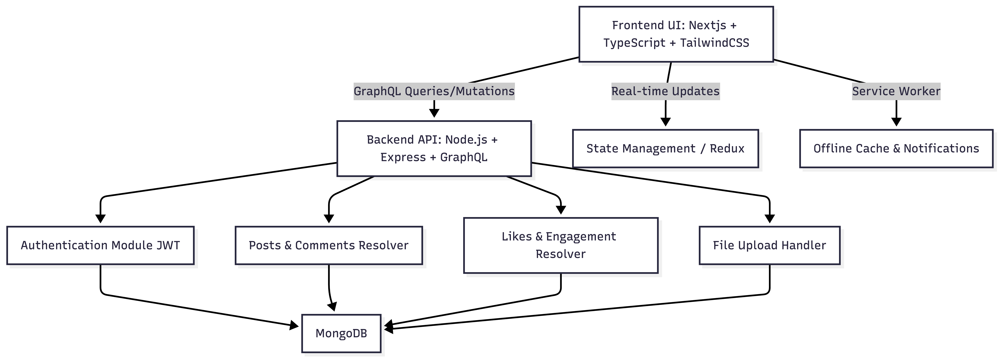

# Craveo Social Media App ~ Architecture

This document outlines the **system architecture** for Craveo Food Social Media App.  
It includes frontend, backend, database, and API interactions to support a dynamic, food-focused social media feed.

### 1. System Overview

Craveo is a full-stack application with three main layers:

1. **Frontend (React/TypeScript + TailwindCSS)**  
   - Renders the feed, posts, profiles, and interactions.
   - Supports **web, mobile, and PWA**.
   - Uses **React Router** for navigation and **state management** for real-time updates.

2. **Backend (Node.js + Express + GraphQL)**  
   - Handles user authentication, post creation, likes, comments, and feed queries.
   - Exposes **GraphQL API** for dynamic and flexible data fetching.
   - Implements **REST endpoints** for authentication and file uploads (images).

3. **Database (MongoDB)**  
   - Stores users, posts, likes, comments, and tags.
   - Supports filtering, search, and sorting queries for dynamic feed generation.

### 2. Architecture Diagram 




**Legend:**

* **Frontend:** User interface and interaction layer
* **Backend:** Business logic, API endpoints, authentication, and GraphQL resolvers
* **Database:** Persistent storage for users, posts, comments, likes, and tags
* **Service Worker:** PWA support for offline access and push notifications


### 3. Folder Structure (Proposed)

```
craveo-social-media-app/
├── README.md                  # Overview of the app 
├── package.json               # Root dependencies 
├── docs/                      # All documentation
│   ├── PRD.md
│   ├── User-Stories.md
│   ├── Architecture.md
│   ├── Build-Timeline.md
│   └── Challenges-And-Lessons.md
│
├── frontend/                  # Next.js App Router frontend
│   ├── app/                   # Next.js modern routing
│   │   ├── layout.tsx         # Main layout (Navbar, Footer)
│   │   ├── globals.css        # Global styles (Tailwind, custom)
│   │   ├── page.tsx           # Home feed page
│   │   ├── profile/
│   │   │   └── page.tsx       # User profile page
│   │   ├── post/
│   │   │   └── [id]/page.tsx  # Dynamic single post page
│   │   ├── create-post/
│   │   │   └── page.tsx       # Page to create a new post
│   │   ├── notifications/
│   │   │   └── page.tsx       # Optional notifications page
│   │   └── auth/
│   │       ├── login/page.tsx
│   │       └── register/page.tsx
│   │
│   │----├── components/        # Reusable UI components
│   │   │   ├── PostCard.tsx
│   │   │   ├── CommentList.tsx
│   │   │   ├── LikeButton.tsx
│   │   │   ├── ShareButton.tsx
│   │   │   ├── Navbar.tsx
│   │   │   └── Footer.tsx
│   │   │
│   │   ├── context/           # React Context
│   │   │   ├── AuthContext.tsx
│   │   │   └── FeedContext.tsx
│   │   │
│   │   ├── hooks/             # Custom hooks
│   │   │   ├── useFeed.ts
│   │   │   └── useAuth.ts
│   │   │
│   │   ├── services/          # API and GraphQL queries/mutations
│   │   │   ├── graphql/       # GraphQL queries/mutations
│   │   │   │   ├── queries.ts
│   │   │   │   └── mutations.ts
│   │   │   └── api.ts
│   │   │
│   │   ├── styles/            # Tailwind overrides, additional CSS
│   │   │   └── components.css
│   │   │
│   │   └── utils/             # Helper functions
│   │       └── formatDate.ts
│   │
│   └── package.json
│
├── backend/
│   ├── src/
│   │   ├── models/            # MongoDB models
│   │   │   ├── User.ts
│   │   │   ├── Post.ts
│   │   │   ├── Comment.ts
│   │   │   └── Like.ts
│   │   │
│   │   ├── resolvers/         # GraphQL resolvers
│   │   │   ├── userResolvers.ts
│   │   │   ├── postResolvers.ts
│   │   │   └── commentResolvers.ts
│   │   │
│   │   ├── schemas/           # GraphQL type definitions
│   │   │   ├── userSchema.ts
│   │   │   ├── postSchema.ts
│   │   │   └── commentSchema.ts
│   │   │
│   │   ├── controllers/       # Business logic for REST or GraphQL endpoints
│   │   │   ├── userController.ts
│   │   │   └── postController.ts
│   │   │
│   │   ├── middleware/        # Authentication, error handling
│   │   │   ├── authMiddleware.ts
│   │   │   └── errorHandler.ts
│   │   │
│   │   ├── utils/             # Utility functions
│   │   │   └── jwt.ts
│   │   │
│   │   └── index.ts           # Backend entry point
│   │
│   └── package.json
│
└── .gitignore

```


### 4. Data Flow (High-Level)

1. **User Request:** User browses feed, likes, comments, or creates posts.
2. **Frontend:** Sends **GraphQL query or mutation** to backend API.
3. **Backend:** Processes request using appropriate resolver.
4. **Database:** Stores/retrieves data from MongoDB.
5. **Response:** Backend returns data to frontend.
6. **UI Update:** React state updates, and the feed reflects new interactions in real-time.


### 5. Considerations

* **Scalability:** MongoDB is flexible for growing content and users.
* **Offline Support:** PWA service worker caches posts for offline browsing.
* **Extensibility:** Backend can add features like analytics or AI-based recipe suggestions.
* **Security:** JWT authentication and input validation for posts, comments, and user data.


This **Architecture.md** gives a full-stack overview with:  
- **Mermaid diagram** for visual architecture  
- Folder structure  
- Data flow and PWA considerations  
- Security and scalability notes 

N/B: More directory and files will be created to maintain a cleaner structure and the structure will be updated as the project progress.


